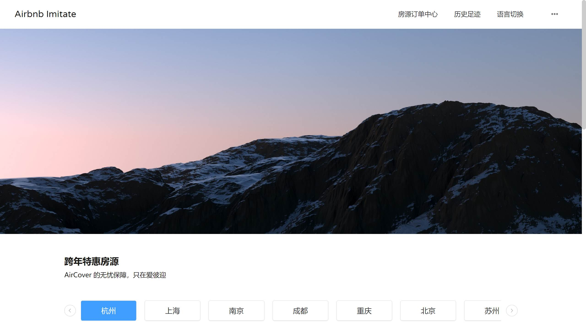

## Vue3 + Vite + TS + ElementPlus 打造 SSR 网站应用

#### SSR 网站应用介绍

一款仿爱彼迎的房屋租赁网站，通过对 SPA 应用的两次改造，从 0 到 1 实现服务端渲染

- 首页 SSR 服务端渲染，同时实现服务端数据预取
- indexDB 数据库和 Mock 接口搭配使用模拟后端请求
- 路由 meta 元信息处理，并进行了 SEO 优化
- 实现登录注册、表单验证和后台管理等用户业务
- 实现页面重定向，登录权限拦截、订单、历史记录模块
- 实现全局语言切换功能（支持中英文）
- 实现图片懒加载、异步组件和 ElementPlus 组件库的基本使用

#### 技术栈支持

- 项目前端是基于 Vue3 + TS + Vuex4 + Vite + Vue-router4 等 Vue3 全新生态系统打造。另外还使用了 ElementPlus 组件库进行了项目页面优化。同时手写 SSR 配置实现了首页的服务端渲染。

- 项目后台使用了 indexed DB 来存储用户数据、全局语言配置、订单信息、历史足迹等数据，同时自行开发一套 Mock 接口，供前端项目来调用，使得前后端在某种程度上做到了解耦。

所用到的技术栈有：

Vue3、Vuex4、Typescript、ES6、Flex、Sass、Mock、Nodejs、SSR、axios、Vite等

个人博客：https://blog.csdn.net/m0_63907100?spm=1000.2115.3001.5343

项目笔记：https://github.com/cocoonnu/WebProjects/blob/main/Markdown/Vue/Vue3_project.md

#### 网站预览

